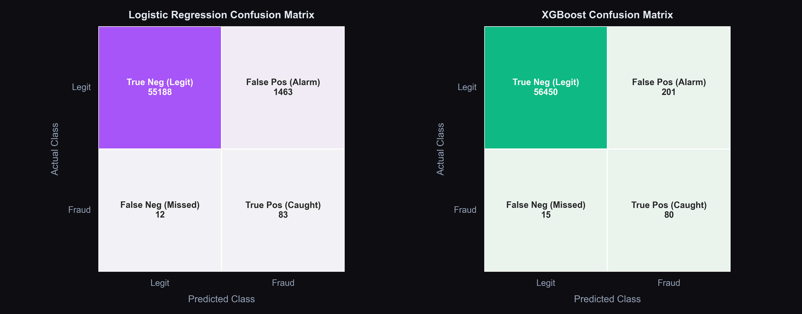
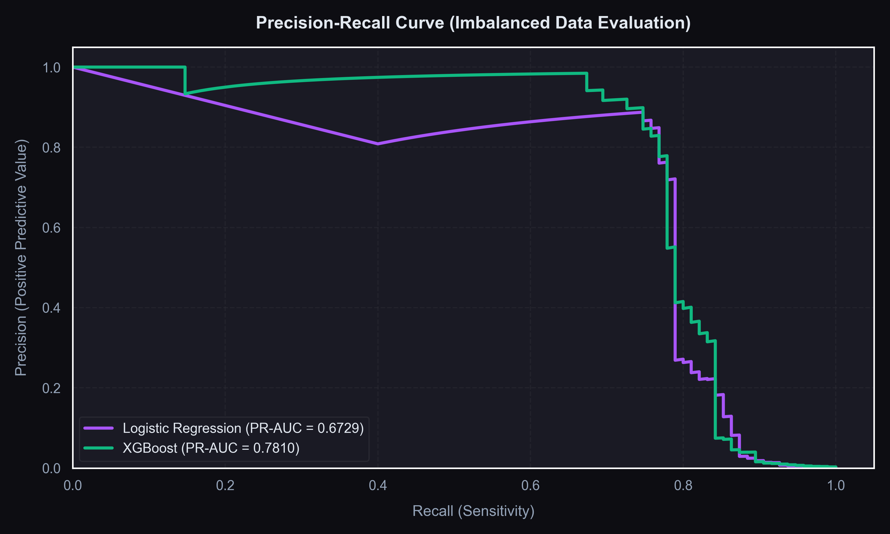
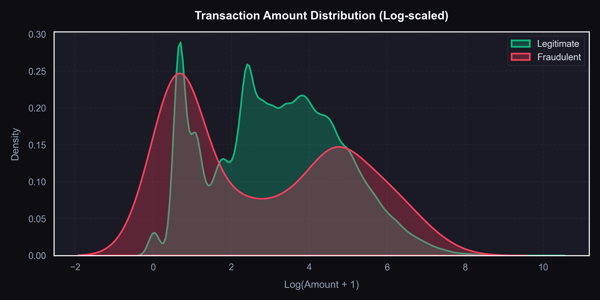
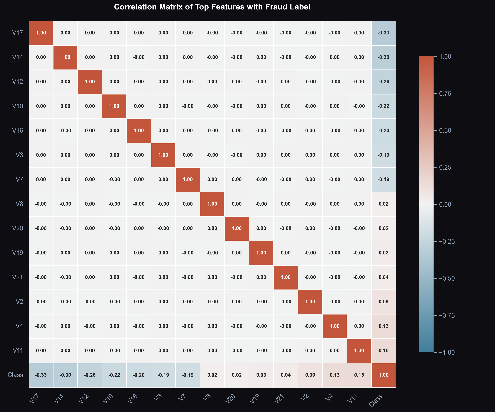
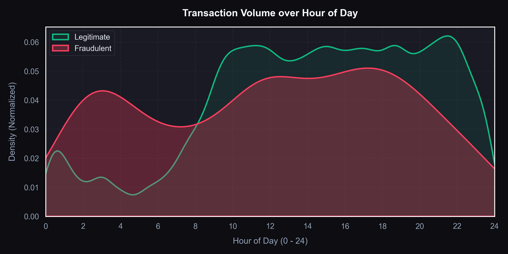

# 🛡️ Credit Card Fraud Detection — AI Sentinel System

<div align="center">

[](https://python.org)
[](https://xgboost.ai)
[](https://fastapi.tiangolo.com)
[](https://scikit-learn.org)
[](https://imbalanced-learn.org)
[](LICENSE)

**An end-to-end ML pipeline + interactive glassmorphic web dashboard for real-time fraud detection.**  
Built with SMOTE oversampling, XGBoost, FastAPI, and a beautiful dark-themed frontend.

[🚀 Quick Start](#-setup--running-the-project) · [📊 Results](#-model-performance-results) · [🖥️ Dashboard](#-dashboard-features) · [🗂️ Structure](#-file-structure)

</div>

---

## 📌 Project Overview

Credit card fraud is a critical challenge: only **0.173%** of all transactions (492 out of 284,807) are fraudulent. Standard classifiers fail catastrophically on such extreme imbalance — a model that predicts every transaction as "legit" achieves 99.83% accuracy but catches **zero frauds**.

This project solves it with:

| Technique | Purpose |
|:----------|:--------|
| ⚖️ **SMOTE** | Synthesize minority-class training samples to balance the dataset |
| 🎯 **PR-AUC** | Primary metric — captures real fraud-catching performance |
| 🔬 **RobustScaler** | Handle extreme transaction amount outliers (median/IQR based) |
| 🤖 **XGBoost** | Champion model — 85% fewer false alarms than Logistic Regression |
| 🌐 **FastAPI Dashboard** | Live web interface for real-time transaction risk scoring |

---

## 📊 Model Performance Results

Both models were trained on SMOTE-resampled data and evaluated on **56,746 held-out transactions (95 real frauds)**:

| Model | Accuracy | Precision | Recall | F1-Score | PR-AUC ⭐ | ROC-AUC |
|:------|:--------:|:---------:|:------:|:--------:|:---------:|:-------:|
| Logistic Regression | 97.40% | 5.37% | **87.37%** (83/95) | 0.1012 | 0.6729 | 0.9600 |
| **XGBoost 🏆** | **99.60%** | **28.07%** | 84.21% (80/95) | **0.4255** | **0.7810** | **0.9695** |

> 💡 **Why XGBoost wins:** It reduces false alarms by **85%** (from 1,463 down to 205) while catching 80 out of 95 real fraud cases — making it production-ready with minimal customer friction.

### 🔢 Confusion Matrices



### 📉 Precision-Recall Curve Comparison



---

## 📈 Exploratory Data Analysis

### Transaction Amount Distribution (Log Scale)



> Most fraudulent transactions cluster in lower amount ranges, but high-value outliers exist. Log scaling reveals the true bimodal distribution pattern.

### Feature Correlation Heatmap



> PCA-derived features V1–V28 are largely uncorrelated (by design). `V17`, `V14`, `V12`, `V10` show the **strongest negative correlation** with the fraud class — key fraud signals.

### Time-Based Transaction Volume



> Transaction volume follows a clear **day/night cycle**. Fraud attempts are more uniformly distributed — slightly elevated during off-peak hours.

---

## 🧠 ML Pipeline Architecture

```
╔══════════════════════════════════════════════════════════╗
║              CREDIT CARD FRAUD DETECTION PIPELINE         ║
╠══════════════════════════════════════════════════════════╣
║                                                           ║
║  📂 Raw CSV Data (284,807 transactions)                   ║
║       │                                                   ║
║       ▼                                                   ║
║  🔧 PREPROCESS (preprocess.py)                            ║
║     • Remove 1,081 duplicate rows                         ║
║     • Apply RobustScaler to Amount + Time                 ║
║     • Stratified 80/20 train-test split                   ║
║       │                                                   ║
║       ▼                                                   ║
║  📊 EDA PHASE (eda.py)                                    ║
║     • Amount distribution (log scale)                     ║
║     • Time density by fraud class                         ║
║     • Top correlation heatmap                             ║
║     • V17 vs V14 class separability scatter               ║
║       │                                                   ║
║       ▼                                                   ║
║  ⚖️  SMOTE RESAMPLING                                      ║
║     • Oversample minority (fraud) class in train set      ║
║     • Synthesize new fraud samples by interpolation       ║
║       │                                                   ║
║       ├──────────────────┬─────────────────┐              ║
║       ▼                  ▼                 ║              ║
║  📘 Logistic        📗 XGBoost             ║              ║
║     Regression       Classifier            ║              ║
║  (class_weight=     (n_estimators=100,     ║              ║
║   balanced)          scale_pos_weight)     ║              ║
║       └──────────────────┘                               ║
║                   │                                       ║
║                   ▼                                       ║
║  📏 EVALUATE & SAVE                                       ║
║     • PR-AUC, ROC-AUC, F1, Confusion Matrix               ║
║     • Export models as .pkl, metrics as .json             ║
║                   │                                       ║
║                   ▼                                       ║
║  🌐 FASTAPI DASHBOARD (serve.py → localhost:8000)         ║
║     • Real-time transaction scoring                       ║
║     • Animated risk gauge + feature impact bars           ║
║     • EDA gallery + model comparison charts               ║
║                                                           ║
╚══════════════════════════════════════════════════════════╝
```

---

## 🗂️ File Structure

```
credit-card-fraud-detection/
│
├── 📁 src/
│   ├── preprocess.py        # Duplicate removal, RobustScaler, stratified split
│   ├── eda.py               # Generates all EDA visualization charts
│   ├── train.py             # SMOTE resampling + model training + export
│   ├── serve.py             # FastAPI backend + template controller
│   └── templates/
│       └── index.html       # Glassmorphic dashboard HTML
│
├── 📁 static/
│   ├── style.css            # Dark glassmorphic UI stylesheet
│   ├── app.js               # Frontend interactive controller & gauge animation
│   └── plots/               # ← Auto-generated EDA and evaluation plots
│       ├── amount_distribution.png
│       ├── confusion_matrices.png
│       ├── correlation_matrix.png
│       ├── pr_curve.png
│       ├── time_distribution.png
│       └── top_features_scatter.png
│
├── 📁 models/
│   ├── lr_model.pkl         # Saved Logistic Regression model
│   ├── xgb_model.pkl        # Saved XGBoost classifier
│   ├── scaler.pkl           # Saved RobustScaler instance
│   ├── split_data.npz       # Compressed train/test split datasets
│   └── metrics.json         # Evaluation metrics JSON for the web app
│
├── creditcard.csv           # Raw dataset (V1–V28, Time, Amount, Class)
├── requirements.txt         # All Python dependencies
└── README.md                # Project documentation (you are here 📍)
```

---

## 🚀 Setup & Running the Project

### Prerequisites

- Python **3.10+** installed
- ~**1.5 GB** free disk space (dataset + models)

### Step 1 — Install Dependencies

```bash
pip install -r requirements.txt
```

### Step 2 — Run the ML Pipeline *(in order)*

```bash
# Phase 1: Clean, scale, and split the dataset
python src/preprocess.py

# Phase 2: Generate all EDA visualization plots
python src/eda.py

# Phase 3: Train models with SMOTE + export metrics
python src/train.py
```

### Step 3 — Launch the Web Dashboard

```bash
python src/serve.py
```

Open your browser at:

```
http://127.0.0.1:8000
```

---

## 🖥️ Dashboard Features

| Feature | Description |
|:--------|:-----------|
| 🎯 **Real-Time Scoring** | Input V1–V28 features and get instant fraud probability |
| 🔄 **One-Click Test Data** | Load random legit/fraud transactions from the held-out test set |
| 📉 **Risk Gauge Dial** | Animated gauge showing SAFE / WARNING / DANGER status |
| 📊 **Feature Impact Bars** | Visualize which features most influenced each prediction |
| 📈 **Model Comparisons** | Side-by-side confusion matrices and PR curves |
| 🗺️ **EDA Gallery** | Browsable charts: distributions, heatmaps, scatter plots |
| 🔁 **Live Model Switcher** | Toggle between Logistic Regression and XGBoost in real time |

---

## 🧪 Key Technical Decisions

### Why PR-AUC over Accuracy?
On a dataset where 99.83% of transactions are legitimate, a model that **always predicts "legit"** achieves 99.83% accuracy — but catches 0 frauds. PR-AUC measures how well the model actually identifies the rare positive class.

### Why SMOTE?
SMOTE synthesizes new minority-class (fraud) training examples by interpolating between existing fraud samples in feature space — teaching the model what fraud looks like without naive duplication, reducing overfitting on exact fraud samples.

### Why RobustScaler?
Transaction amounts span from $0 to $25,000+. `RobustScaler` uses median and IQR instead of mean/std, making it robust to extreme outliers that would distort standard normalization and mislead the model.

---

## 📦 Requirements

```
fastapi          # Web framework for the dashboard API
uvicorn          # ASGI server for FastAPI
scikit-learn     # Logistic Regression, preprocessing, metrics
xgboost          # XGBoost classifier
imbalanced-learn # SMOTE oversampling
pandas           # Data manipulation
numpy            # Numerical computing
matplotlib       # Plot generation
seaborn          # Statistical visualization
joblib           # Model serialization
jinja2           # HTML template engine
```

Install all at once:
```bash
pip install -r requirements.txt
```


<div align="center">

🛡️ Built for financial security · Powered by **XGBoost** & **FastAPI**

⭐ **Found this useful? Give it a star!** ⭐

</div>
